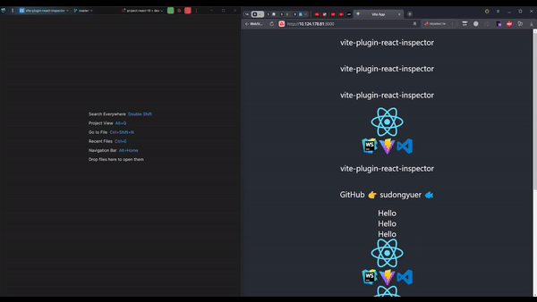

## 👀 Why
When developing a React app, you have a lot of components in your app. Sometimes you may forget where the code is located that you want to edit. Then you need this plugin to help you find the code, just click the dom in the browser and this plugin can help you to open the editor and find the code.


## 📖 Introduction
This website plugin allows users to navigate to the local IDE code directly from the React browser component with the "AltLeft" key pressed (by default) and a mouse click, which is similar to Chrome inspector, but more advanced.



## 🌈 Features

- Support react 16
- Support react 17
- Support react 18
- All features out of box just need add this plugin in vite.config.ts

## 📦 Installation

```bash
# pnpm 
pnpm add vite-plugin-react-find -D

# yarn
yarn add vite-plugin-react-find -D

# npm
npm install vite-plugin-react-find -D
```

## 🦄 Usage

### Configuration `vite.config.ts`

```ts
// ❗️this plugin must before react

import { defineConfig } from 'vite'
import react from '@vitejs/plugin-react'
import reactFind from 'vite-plugin-react-find'

export default defineConfig({
  plugins: [
    reactFind(),
    react(),
  ],
})
```

launch your project, and click the "AltLeft" button (AltLeft by default), then click on the left mouse button to open the component in the code

```dotenv
VITE_REACT_EDITOR_ACTION=AltLeft # any key code 
```

## 🔌  Configuration IDE / Editor

It uses an **environment variable** named **`REACT_EDITOR`** to specify an IDE application, but if you do not set this variable, it will try to open a common IDE that you have open or installed once it is certified.

For example, if you want it always open VSCode when inspection clicked, set `export REACT_EDITOR=code` in your shell.


### VSCode

- install VSCode command line tools, [see the official docs](https://code.visualstudio.com/docs/setup/mac#_launching-from-the-command-line)

- set env to shell, like `.bashrc` or `.zshrc`

  ```bash
  export REACT_EDITOR=code
  ```


### WebStorm

- just set env with an absolute path to shell, like `.bashrc` or `.zshrc` (only MacOS)

  ```bash
  export REACT_EDITOR='/Applications/WebStorm.app/Contents/MacOS/webstorm'
  ```

**OR**

- install WebStorm command line tools

- then set env to shell, like `.bashrc` or `.zshrc`

  ```bash
  export REACT_EDITOR=webstorm
  ```


### Vim

Yes! you can also use vim if you want, just set env to shell

```bash
export REACT_EDITOR=vim
```

## 🌸
implemented on the basis of [vite-plugin-react-inspector](https://www.npmjs.com/package/vite-plugin-react-inspector)
